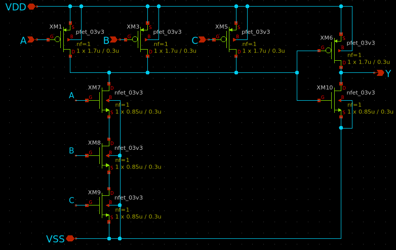
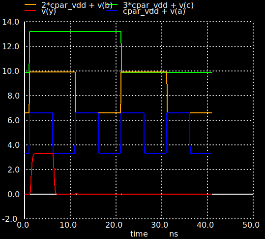
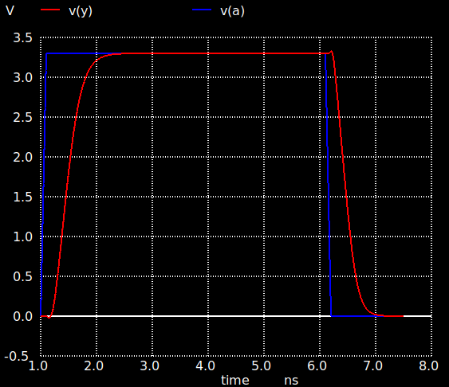

# 3-input AND Gate

Designer: Prasnjit Biswal (AND3_1X)

**DESIGN FILES**

- [Schematic](./gf180mcu_osu_sc_gp12t3v3__and3_1.sch)
- [Netlist](./gf180mcu_osu_sc_gp12t3v3__and3_1.spice)
- [Testbench](../../../../tb_digital/tb_and3_12t/tb_gf180mcu_osu_sc_gp12t3v3_and3_1.spice)

**SIMULATION RESULTS**

**DELAY AND POWER CHARACTERIZATION AND3_1X (3.3V)**

| Metric | unit | Cl=5f | Cl=10f | Cl=50f |
|--------|------|-------|--------|--------|
| **trise** (10-90%)| ns | 0.11 | 0.15 | 0.52 |
| **tfall** (90-10%) | ns | 0.07 | 0.11 | 0.41 |
| **tdel-rise** (50-50%) | ns | 0.2 | 0.23 | 0.42 |
| **tdel-fall** (50-50%) | ns | 0.12 | 0.14 | 0.3 |
| **Ivddh**(avg) | uA | 4.9 | 6.5 | 19.7 |
| **Ileak** | nA | 0.01 | 0.01 | 0.01 |

**NOTE** 1) Input slew-rate is 100 ps 2) Average current is claculated over a 10 ns period.

**SCHEMATIC**

**PLOTS**

**FUNCTIONAL** 

**TRANSIENT**

