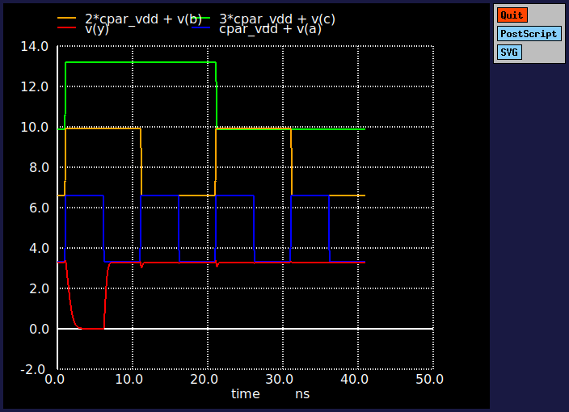
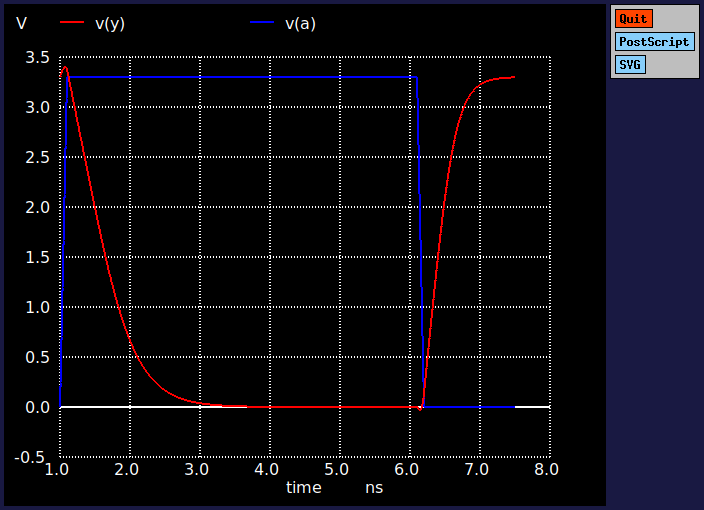

# 3-input NAND gate

Designer: Vishal Roy

**DESIGN FILES**

- [Schematic](./gf180mcu_osu_sc_gp12t3v3__nand3_1.sch)
- [Netlist](./gf180mcu_osu_sc_gp12t3v3__nand3_1.spice)
- [Testbench](../../../../tb_digital/tb_nand3_12t/TB_gf180mcu_osu_sc_gp12t3v3__nand3_1.spice)

**DELAY AND POWER CHARACTERIZATION **

| Metric | Cl=5f | Cl=10f | Cl=50f |
|--------|-------|--------|--------|
| **trise** (10-90%)| 0.1 | 0.14 | 0.52 |
| **tfall** (90-10%) | 0.2 | 0.3 | 1.04 |
| **tdel-rise** (50-50%) | 0.072 | 0.1 | 0.27 |
| **tdel-fall** (50-50%) | 0.14 | 0.2 | 0.55 |
| **Ivddh**(avg) | 2.3 | 4.1 | 17.6 |
| **Ileak** | 0.01 | 0.01 | NA |

**NOTE** 1) Input slew-rate is 100 ps 2) Average current is claculated over a 10 ns period.

**SCHMATIC** 

**FUNCTIONAL PLOT** 

**RISE/FALL/DELAY**

