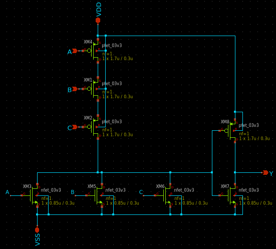
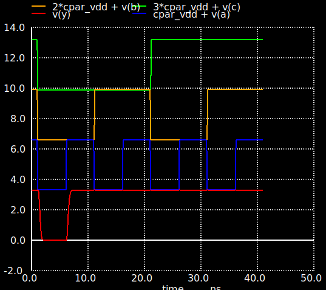
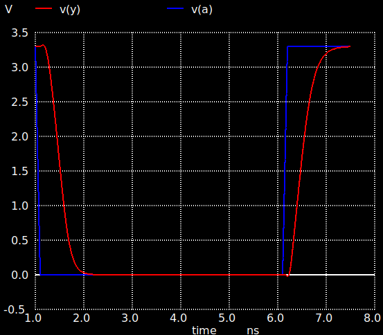

# 3-input OR gate

Designer: Aditya Pratyush Mohapatra (OR3_1X)

**DESIGN FILES**

- [Xschem Schematic](./gf180mcu_osu_sc_gp9t3v3__or3_1.sch)
- [Netlist](./gf180mcu_osu_sc_gp9t3v3__or3_1.spice)
- [Testbench](../../../../tb_digital/tb_or3_9t/TB_gf180mcu_osu_sc_gp9t_or3_1.spice)
plot-functional-or3_1.png
plot-transient-or3_1.png
xschem-or3_1.png

**DELAY AND POWER CHARACTERIZATION **

| Metric | unit | Cl=5f | Cl=10f | Cl=50f |
|--------|------|-------|--------|--------|
| **trise** (10-90%)| ns | 0.09 | 0.13 | 0.5 |
| **tfall** (90-10%) | ns | 0.01 | 0.14 | 0.44 |
| **tdel-rise** (50-50%) | ns | 0.13 | 0.16 | 0.34 |
| **tdel-fall** (50-50%) | ns | 0.23 | 0.26 | 0.44 |
| **Ivddh**(avg) | uA | 8.8 | 10.4 | 23.6 |
| **Ileak** | nA | 0.01 | 0.01 | 0.01 |

**NOTE** 1) Input slew-rate is 100 ps 2) Average current is claculated over a 10 ns period.

**SCHEMATIC**

**FUNCTIONAL SIM RESULTS**

**RISE/FALL/DELAY**

